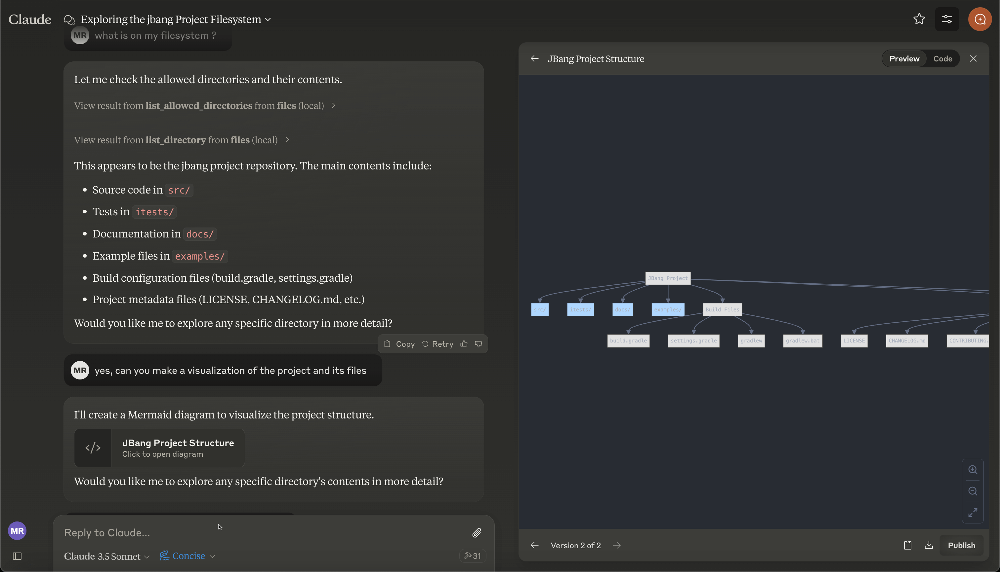

# Model Context Protocol Server for filesystem

This Model Context Protocol(MCP) server enables Large Language Models (LLMs) to list, read and modify files from the filesystem.



## General Usage 

1. Install [jbang](https://www.jbang.dev/download/)
2. Configure your MCP Client to run the server (see [Claude Desktop Config](#claude-desktop-config) below)

Use the following command to start the server with access to specific paths.
```shell
jbang filesystem@quarkiverse/quarkus-mcp-servers ~/code/quarkiverse ~/code/jbang 
```

## Claude Desktop Config and [mcp-cli](https://github.com/chrishayuk/mcp-cli)

Add this to your `claude_desktop_config.json` or `server_config.json` file:

```json
{
  "mcpServers": {
    "filesystem": {
      "command": "jbang",
      "args": [
        "filesystem@quarkiverse/quarkus-mcp-servers",
        "[path1]",
        "[path2]"
      ]
    }
  }
}
```

## Native Image/Executable

Using native image, the startup time is almost instant. 

You can download the native images from the [release page](https://github.com/quarkiverse/quarkus-mcp-servers/releases).

Then use the executable for your platform in your MCP client.

Example for MacOS arm64 (M1, M2, etc.):

```json
{
  "mcpServers": {
    "filesystem": {
      "command": "jbang",
      "args": [
        "mcp-server-filesystem-osx-aarch_64",
        "[path1]",
        "[path2]"
      ]
    }
  }
}
```

You can of course also rename the executable to something else, like `mcp-server-filesystem` if you want.

### Troubleshooting

**jbang not found**
* Make sure you have `jbang` installed and available in your PATH
* Alternatively, use full path to jbang executable (e.g. `/Users/username/.jbang/jbang`)

**Get more logging**

To get more detailed logging you can add the following parameters to the jbang command line:

```shell
-Dquarkus.log.file.enable=true -Dquarkus.log.file.path=${user.home}/mcp-server-filesystem.log
```

Example:

```shell
jbang -Dquarkus.log.file.enable=true -Dquarkus.log.file.path=${user.home}/mcp-server-filesystem.log filesystem@quarkiverse/quarkus-mcp-servers [path1] [path2] ...
```

### How was this made?

The MCP server uses Quarkus, the Supersonic Subatomic Java Framework and its Model Context Protocol support.

If you want to learn more about Quarkus MCP Server support, please see this [blog post](https://quarkus.io/blog/mcp-server/) 
and the Quarkus MCP Server [extension documentation](https://docs.quarkiverse.io/quarkus-mcp-server/dev/).

To launch the server it uses [jbang](https://jbang.dev/) to
setup Java and run the .jar as transparent as possible. Very similar to how `uvx`, `pipx`, `npmx` and others works; just for Java. 