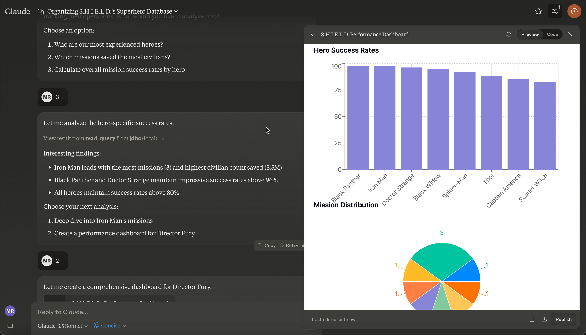

# Model Context Protocol Server for JDBC

This Model Context Protocol(MCP) server enables Large Language Models (LLMs) to inspect, query, create and modify database content given just a Java Database Connectivity (JDBC) url.

Supported databases include PostgresSQL, Oracle, MariaDB, Sqlite and [many more](#supported-jdbc-variants).


[](https://youtu.be/E6IJvQZ3MCI)

See video [here](https://youtu.be/E6IJvQZ3MCI).

## General Usage 

1. Install [jbang](https://www.jbang.dev/download/)
2. Configure your MCP Client to run the server (see [Claude Desktop Config](#claude-desktop-config) below)

Below are examples of command lines to use for configuring the server.

Start with an empty database (in-memory h2 database):

```shell
jbang jdbc@quarkiverse/quarkus-mcp-servers
```

A live database (any common JDBC compatible database):

```shell
jbang jdbc@quarkiverse/quarkus-mcp-servers [jdbc_url]
```

For example, to connect to a already running Oracle database:

```shell
jbang jdbc@quarkiverse/quarkus-mcp-servers jdbc:oracle:thin:@localhost:1521:orcl
```

You can also specify a user and password separately, here for a PostgreSQL database:

```shell
jbang jdbc@quarkiverse/quarkus-mcp-servers jdbc:postgresql://localhost:5432/sakila -u sakila -p p_ssW0rd
```

## Downloadable databases

JBang can download files from the web and feed them directly to databases like h2 and sqlite.

That is done using the %{url} syntax.

Following is an example of how to connect to a Chinook database in SQLite, downloading the `Chinook_Sqlite.sqlite` file from github.

```shell
jbang jdbc@quarkiverse/quarkus-mcp-servers jdbc:sqlite:%{https://github.com/lerocha/chinook-database/raw/master/ChinookDatabase/DataSources/Chinook_Sqlite.sqlite}
```

There are interesting examples of sample data available online you can use to explore data.

Below are a non-exhaustive list of databases and example JDBC urls that are known to work with this server as-is (no additional configuration required).

### Example databases 

**Chinook**

Sample music store data including artists, albums, tracks, invoices etc.
```
jdbc:sqlite:%{https://github.com/lerocha/chinook-database/raw/master/ChinookDatabase/DataSources/Chinook_Sqlite.sqlite}
```

**Northwind**

Classic Microsoft sample database with customers, orders, products etc.

```
jdbc:sqlite:%{https://github.com/jpwhite3/northwind-SQLite3/raw/refs/heads/main/dist/northwind.db}
```

**Netflix Movies**

Sample movie data based on Netflix catalog
```
jdbc:sqlite:%{https://github.com/lerocha/netflixdb/releases/download/v1.0.0/netflixdb.sqlite}
```

## Supported JDBC variants

| Database | Dependency |
|----------|------------|
| [MariaDB](https://mariadb.com/kb/en/mariadb-connector-j/) | org.mariadb.jdbc:mariadb-java-client:RELEASE |
| [MySQL](https://dev.mysql.com/doc/connector-j/8.0/en/) | mysql:mysql-connector-java:RELEASE |
| [PostgreSQL](https://jdbc.postgresql.org/documentation/head/connect.html) | org.postgresql:postgresql:RELEASE |
| [Oracle](https://docs.oracle.com/en/database/oracle/oracle-database/19/jjdbc/JDBC-driver-connection-url-syntax.html) | com.oracle.database.jdbc:ojdbc10:RELEASE |
| [SQL Server](https://docs.microsoft.com/en-us/sql/connect/jdbc/microsoft-jdbc-driver-for-sql-server?view=sql-server-ver15) | com.microsoft.sqlserver:mssql-jdbc:RELEASE |
| [SAP DB](https://help.sap.com/viewer/0eec0d68141541d1b07893a39944924e/2.0.02/en-US/109397c2206a4ab2a5386d494f4cf75e.html) | com.sapcloud.db.jdbc:ngdbc:RELEASE |
| [Informix](https://www.ibm.com/docs/en/informix-servers/14.10?topic=SSGU8G_14.1.0/com.ibm.jdbc_pg.doc/ids_jdbc_501.htm) | com.ibm.informix:jdbc:RELEASE |
| [Firebird](https://www.firebirdsql.org/file/documentation/drivers_documentation/java/3.0.7/firebird-classic-server.html) | org.firebirdsql.jdbc:jaybird:RELEASE |
| [hsqldb](https://hsqldb.org/doc/2.0/guide/dbproperties-chapt.html) | org.hsqldb:hsqldb:RELEASE |
| [h2](https://www.h2database.com/html/features.html#database_url) | com.h2database:h2:RELEASE |
| [Apache Derby](https://db.apache.org/derby/docs/10.8/devguide/cdevdvlp17453.html) | org.apache.derby:derby:RELEASE |
| SQLite | org.xerial:sqlite-jdbc:RELEASE |

## Components

Below are the MCP components provided by this server.

### Tools 

* **read_query** - do a SELECT query on the database
* **write_query** - do a INSERT, UPDATE, DELETE query on the database
* **create_table** - create a table in the database
* **list_tables** - list all tables in the database
* **describe_table** - describe a table

### Prompts

* **jdbc_demo** - example prompt to get started exploring the server (similar to the one in sqllite MCP)

## Claude Desktop Config and [mcp-cli](https://github.com/chrishayuk/mcp-cli)

Add this to your `claude_desktop_config.json` or `server_config.json` file:

```json
{
  "mcpServers": {
    "jdbc": {
      "command": "jbang",
      "args": [
        "jdbc@quarkiverse/quarkus-mcp-servers",
        "[jdbc_url]"
      ]
    }
  }
}
```

### Troubleshooting

**jbang not found**
* Make sure you have `jbang` installed and available in your PATH
* Alternatively, use full path to jbang executable (e.g. `/Users/username/.jbang/jbang`)

**Get more logging**

To get more detailed logging you can add the following parameters to the jbang command line:

```shell
-Dquarkus.log.file.enable=true -Dquarkus.log.file.path=${user.home}/mcp-server-jdbc.log
```

Example:

```shell
jbang -Dquarkus.log.file.enable=true -Dquarkus.log.file.path=${user.home}/mcp-jdbc.log jdbc@quarkiverse/quarkus-mcp-servers jdbc:h2:mem:testdb
```

## Native Image/Executable

Although the server can be compiled to a native executable, it is not recommended as then it is not possible to dynamically load the relevant JDBC driver.

You can however compile a server that targets a specific JDBC driver, but that is for now
left up as an exercise to the reader. If you are interested in this, please open issue or PR.

### How was this made?

The MCP server uses Quarkus, the Supersonic Subatomic Java Framework and its Model Context Protocol support.

If you want to learn more about Quarkus MCP Server support, please see this [blog post](https://quarkus.io/blog/mcp-server/) 
and the Quarkus MCP Server [extension documentation](https://docs.quarkiverse.io/quarkus-mcp-server/dev/).

To launch the server and handle the magic setup of JDBC urls it uses [jbang](https://jbang.dev/) to
setup Java and run the .jar as transparent as possible. Very similar to how `uvx`, `pipx`, `npmx` and others works; just for Java. 