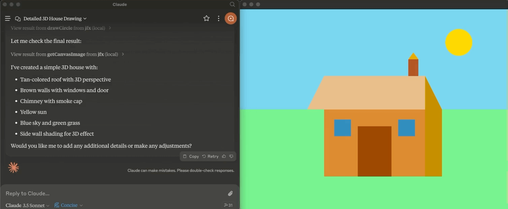

# Model Context Protocol Server for JavaFX

This Model Context Protocol(MCP) server enables Large Language Models (LLMs) to make drawings using JavaFX primities.

The server is implemented using Quarkus MCP and JavaFX.

Initial idea and implementation is from [@konczdev](https://gist.github.com/konczdev/5e6774d2d8640bf83baab88cb068bcc2)

[](https://www.youtube.com/watch?v=Wnh_-0dAaDI)

See video [here](https://www.youtube.com/watch?v=Wnh_-0dAaDI).

## General Usage 

1. Install [jbang](https://www.jbang.dev/download/)
2. Configure your MCP Client to run the server as `jbang jfx@quarkiverse/quarkus-mcp-servers` (see [Claude Desktop Config](#claude-desktop-config) below)

## Claude Desktop Config and [mcp-cli](https://github.com/chrishayuk/mcp-cli)

Add this to your `claude_desktop_config.json` or `server_config.json` file:

```json
{
  "mcpServers": {
    "jfx": {
      "command": "jbang",
      "args": [
        "jfx@quarkiverse/quarkus-mcp-servers"
      ]
    }
  }
}
```

## Native Image/Executable

At this moment the jfx server cannot be compiled to a native executable given the JavaFX dependencies. 

It should be possible to do this using GluonFX, but that is for now left up as an exercise to the reader. If you are interested in working on this, please open issue or PR. 