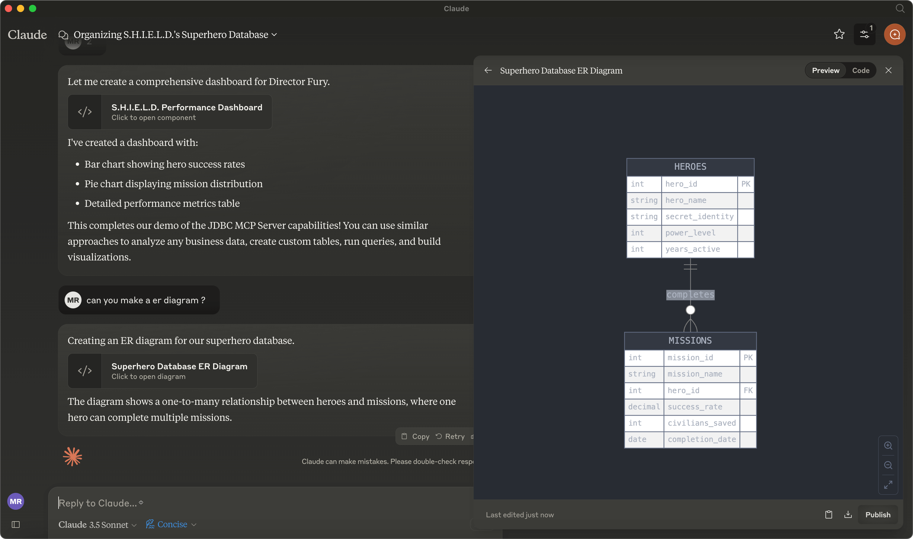

# Model Context Protocol Server for jvminsight

This Model Context Protocol(MCP) server enables Large Language Models (LLMs) to get insights into JVM applications.

This jvminsights lets you attach to jvm processes on your local machine and get info about it.

Also lets you execute tools found in `bin` folder of `java.home`.

Below is example of output from using the provided `investigateJavaProcess` prompt:


Other interesting questions you can consider asking are:

- "What java processes do I have running?"
- "Why is my petclinic using so much memory?"
- "Create a visual of the memory usage of my process" 

## General Usage 

1. Install [jbang](https://www.jbang.dev/download/)
2. Configure your MCP Client to run the server (see [Claude Desktop Config](#claude-desktop-config) below)

Below are examples of command lines to use for configuring the server.

Start server:

```shell
jbang jvminsight@quarkiverse/quarkus-mcp-servers
```

It requires Java 17 or higher. If you need/want a specific Java version, i.e. Java 25 you can add `--java 25` to the jbang command.

I.e.:


```shell
jbang --java 25 jvminsight@quarkiverse/quarkus-mcp-servers
```

## Security

This MCP server does allow to connect to any running Java processes and execute commands that can have ill sideeffects. 
Thus only use it with MCP Clients you trust.

Therefore we do *not* allow running arbitrary commands - only commands found in the `bin` dir of `java.home` property.

You can *optionally* set `-Djvminsight.paths` to a comma separated list of directories to allow to be exposed. 

I.e.:

```shell
jbang -Djvminsight.paths=/opt/java17/bin,/opt/java21/bin jvminsight@quarkiverse/quarkus-mcp-servers
```

## Components

Below are the MCP components provided by this server.

### Tools 

Based on the provided Java code, here's a markdown-formatted list of the tools and prompts available in the `MCPServerJvmInsight` class:

### Tools

- **jps**
  - Description: List all running JVM processes
  - Parameters: None

- **attach**
  - Description: Attach to a JVM process, returns the pid of the attached process if successful
  - Parameters: 
    - `pid` (String): Process ID to attach to

- **getSystemProperties**
  - Description: Get the system properties of a JVM process
  - Parameters: 
    - `pid` (String): Process ID to inspect

- **listAavailableTools**
  - Description: List all available tools in java.home or jvminsight.paths
  - Parameters: None

- **executeJavaTool**
  - Description: Execute a Java tool or list all available tools if no tool name is provided
  - Parameters:
    - `tool` (String): Tool name to execute, or empty to list all tools
    - `args` (String...): Arguments to pass to the tool

### Prompts

- **investigateJavaProcess**
  - Description: Investigate and analyze a Java process running on the system
  - Parameters:
    - `processIdentifier` (String): Process ID or descriptive name of the Java process to investigate
    - `investigationFocus` (String, optional): Specific areas to focus on (e.g., 'memory', 'threads', 'gc', 'all')

## Claude Desktop Config and [mcp-cli](https://github.com/chrishayuk/mcp-cli)

Add this to your `claude_desktop.json` or `server_config.json` file:

```json
{
  "mcpServers": {
    "jdbc": {
      "command": "jbang",
      "args": [
        "mcp-server-jvminsight@quarkiverse/quarkus-mcp-servers"
      ]
    }
  }
}
```